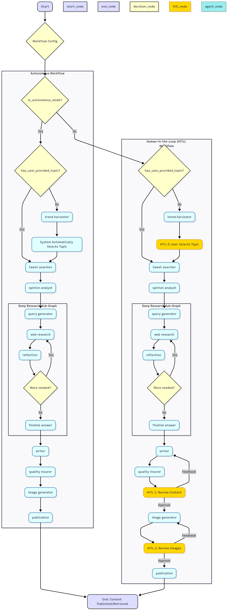

# AutoX 🚀

An autonomous AI agent team for real-time, trend-driven content creation.

<p style="text-align: center;">
  
</p>

## 🌟 About The Project

AutoX is a **LangGraph** agent-based system that leverages real-time trends and news to automate wide range content creation. From X tweets and threads, to articles, newsletters and social media posts. The team of AI agents handles the entire workflow, from initial researches and writing to image creation and even direct publishing on X. It offers deep flexibility in adapting to any brand voice and can operate fully autonomously or with human oversight for fine-tuned control.

The system features a clean, modern web interface built using **Next.js** and **Shadcn/UI**, making it easy to configure, launch, and monitor the workflow in real time.


### Key Features

* **🛠️ Fullstack application**: with a `Next.js` frontend and `LangGraph` backend.
* **📈 Real-Time Trend Analysis**: Automatically incorporates emerging topics and breaking news from X and the web to produce relevant, timely content.
* **✍️ Multi-Format Content & Image Generation**: Can generate comprehensive content format, long-form articles, tweets, threads, and social media posts or newsletters, along with AI-generated images to accompany the content.
* **🌐 Deep Research Capability**: Agents perform targeted web research to support content generation with up-to-date, verifiable information. Inspired by 
* **🗣️ Dynamic Brand Voice Adaptation**: Allows you to define a specific tone—such as formal, technical, or conversational—which is consistently applied across all generated content.
* **🤖 Fully Autonomous or Human-Guided**: The workflow can run independently or include optional Human-in-the-Loop (HiTL) checkpoints for review and editing.
* **🚀 Direct Publishing & Flexible Output**: Content can be published directly to X or exported for use.
* **📊 Live Progress Dashboard**: Provides a real-time overview of the multi-agent workflow, including task status and output previews.


## 🏗️ Architecture

The project is a monorepo composed of a FastAPI backend and a Next.js frontend.

### Backend

-   **Framework**: **FastAPI** serves the REST API and WebSocket for real-time communication.
-   **Agentic Core**: **LangGraph** orchestrates the stateful, multi-agent workflow.
-   **Data Validation**: **Pydantic** ensures data integrity between the frontend, backend, and agent states.
-   **Dependencies**: Managed by **UV**.

### Frontend

-   **Framework**: **Next.js** (with the App Router).
-   **Language**: **TypeScript**.
-   **UI**: **Shadcn/UI** and **Tailwind CSS** for a modern, responsive interface.
-   **Form Management**: **React Hook Form** and **Zod** for robust, type-safe forms.
-   **State & Data Fetching**: **React Context** and **TanStack Query**.

## 🚀 Getting Started

Follow these steps to set up and run the project locally.

### Prerequisites

-   Node.js and npm
-   Python 3.12+ and [UV](https://github.com/astral-sh/uv)
-   [Docker](https://www.docker.com/get-started) and [Docker Compose](https://docs.docker.com/compose/install/) (for containerized setup)

### Option 1: Manual Setup

#### 1. Backend Setup

First, set up and launch the backend server.

```bash
# 1. Navigate to the backend directory
cd x_automation_app/backend

# 2. Create and activate a virtual environment
uv venv
source .venv/bin/activate
# On Windows, use: .venv\Scripts\activate

# 3. Install dependencies
uv pip install -e .

# 4. Set up environment variables
# Copy the template to a new .env file
cp env.template .env

# 5. Edit the .env file with your credentials
```

You will need to provide the following in the `.env` file:
-   `GEMINI_API_KEY`: Mandatory for the deep research agent.
-   `OPENAI_API_KEY`: For the main content generation agents.
-   `X_API_KEY`: From a service like `twitterapi.io` for scraping.
-   `USER_PROXY`: A proxy is required for X login automation.
-   Optionally, provide AWS credentials for image uploads and LangSmith for tracing.

```bash
# 6. Launch the backend server
uvicorn app.main:app --reload
# The backend will be running at http://localhost:8000
```

#### 2. Frontend Setup

In a separate terminal, set up and launch the frontend application.

```bash
# 1. Navigate to the frontend directory
cd x_automation_app/frontend

# 2. Install dependencies
npm install

# 3. Launch the frontend development server
npm run dev
```

The application will be accessible at **http://localhost:3000**.

### Option 2: Docker Compose Setup

Alternatively, you can run the entire application using Docker.

1.  **Configure Environment Variables**

    Just like in the manual setup, the backend needs its environment variables.

    ```bash
    # 1. Navigate to the backend directory
    cd x_automation_app/backend

    # 2. Create the .env file from the template
    cp env.template .env
    ```

    Now, edit the newly created `.env` file and add your credentials. The Docker service will automatically load this file.

2.  **Launch with Docker Compose**

    From the root directory of the project, run the following command:

    ```bash
    docker-compose up --build -d
    ```

    This command will build the Docker images for the frontend and backend and start the services in the background.

    The application will be accessible at the same URLs:
    -   Frontend: **http://localhost:3000**
    -   Backend: **http://localhost:8000**

## 🤖 The Agent Team

The workflow is composed of several specialized agents and nodes that collaborate to generate and publish content.

-   **🔎 Trend Harvester**: Identifies trending topics on X for a specified location.
-   **🐦 Tweet Searcher**: Gathers relevant, recent tweets for a given topic to understand public sentiment and talking points.
-   **🤔 Opinion Analyzer**: Analyzes the collected tweets to create a summary of public opinion and sentiment.
-   **✍️ Writer**: Drafts the final content (e.g., Tweet, Thread) based on the research and analysis.
-   **✨ Quality Assurer**: Reviews and refines the drafted content, generating image prompts if necessary.
-   **🎨 Image Generator**: Creates images based on the prompts from the QA agent.
-   **📢 Publicator**: Publishes the final content and images to X.
-   **🧠 Deep Research Sub-Graph**: An embedded workflow that performs deep web searches to create a comprehensive research report on a topic.
-   **🙋‍♂️ Human Validation Nodes**: These nodes pause the graph and await user input for topic selection, content approval, and image validation.

## Project Structure

```
x_automation_app/
├── backend/
│   ├── app/
│   │   ├── agents/      # Core agent logic and graph definition
│   │   ├── utils/       # Utilities for prompts, schemas, etc.
│   │   └── main.py      # FastAPI application entrypoint
│   └── pyproject.toml   # Backend dependencies
└── frontend/
    ├── src/
    │   ├── app/         # Next.js pages and routing
    │   ├── components/  # Reusable React components
    │   ├── contexts/    # Global state management (Auth, Workflow)
    │   └── lib/         # API client and utility functions
    └── package.json     # Frontend dependencies
```