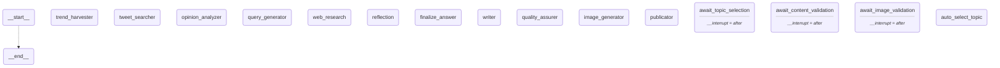

```mermaid
---
config:
  flowchart:
    curve: linear
---
graph TD;
	__start__(<p>__start__</p>)
	trend_harvester(trend_harvester)
	tweet_searcher(tweet_searcher)
	opinion_analyzer(opinion_analyzer)
	query_generator(query_generator)
	web_research(web_research)
	reflection(reflection)
	finalize_answer(finalize_answer)
	writer(writer)
	quality_assurer(quality_assurer)
	image_generator(image_generator)
	publicator(publicator)
	await_topic_selection(await_topic_selection<hr/><small><em>__interrupt = after</em></small>)
	await_content_validation(await_content_validation<hr/><small><em>__interrupt = after</em></small>)
	await_image_validation(await_image_validation<hr/><small><em>__interrupt = after</em></small>)
	auto_select_topic(auto_select_topic)
	__end__(<p>__end__</p>)
	__start__ -.-> __end__;
	classDef default fill:#f2f0ff,line-height:1.2
	classDef first fill-opacity:0
	classDef last fill:#bfb6fc

```