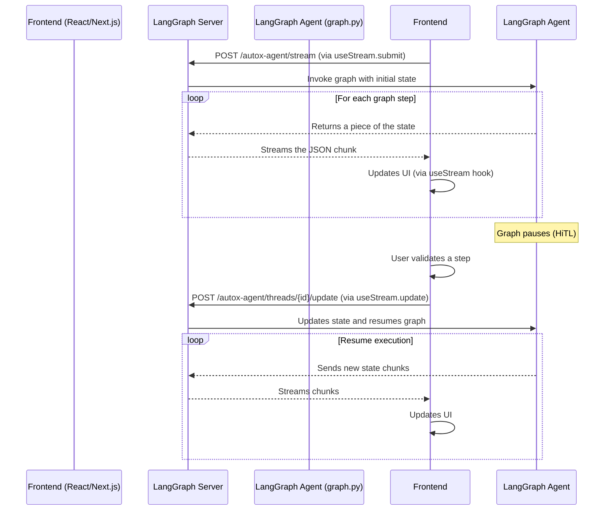

# Migration Plan to LangGraph Native Streaming

This document outlines the steps required to evolve the `x_automation_app` application from a WebSocket-based streaming architecture to an implementation leveraging LangGraph's native streaming capabilities, similar to the `fullstack-langgraph-example` project.

The goal is to simplify the codebase, reduce complexity, and rely on the robust features provided by the LangGraph server and its client SDK.

## Key Principles of the New Architecture

1. **Backend:** The server will no longer be managed directly by `uvicorn`, but by the `langgraph up` command. Configuration will be done via a new `langgraph.json` file. The LangGraph server will automatically expose HTTP endpoints for streaming (`/stream`), state updates (`/update` for HiTL), and more.
2. **Frontend:** Communication with the backend will be fully handled by the `@langchain/langgraph-sdk/react` package. The `useStream` hook will replace all manual WebSocket connection logic, message handling, and validation API calls.
3. **Communication:** The data flow becomes more streamlined. The frontend, through the `useStream` hook, will interact directly with the standardized endpoints provided by the LangGraph server, removing the need for custom endpoints like `/workflow/ws/{thread_id}` and `/workflow/validate`.

## Target Architecture Diagram



---

## Action Plan - Backend (`x_automation_app/backend/`)

### Step 1: Update Dependencies

Ensure that `langgraph` is installed with server dependencies. If using `pyproject.toml`, add:

```toml
# pyproject.toml
[project]
dependencies = [
    # ... other dependencies
    "langgraph[server]",
]
```

Then install using `pip install -e .` or your preferred tool.

### Step 2: Create the `langgraph.json` File

At the root of the `x_automation_app/backend/` directory, create a `langgraph.json` file with the following content:

```json
{
  "graphs": {
    "autox-agent": "app.agents.graph:graph"
  },
  "http": {
    "app": "app.main:app"
  },
  "env": ".env"
}
```

* **`graphs`**: Tells the server to expose the `graph` object from `app/agents/graph.py` under the identifier `autox-agent`.
* **`http`**: Tells the server to use your existing FastAPI app (`app` from `app/main.py`) for non-LangGraph routes (e.g., authentication endpoints).

### Step 3: Clean Up `app/main.py`

Completely remove endpoints that are no longer necessary:

1. **Remove WebSocket:** Delete the entire `workflow_ws` function and its `@app.websocket("/workflow/ws/{thread_id}")` decorator.
2. **Remove workflow start logic:** Delete the `start_workflow` function and its `@app.post("/workflow/start")` decorator. Thread creation and graph invocation will now be handled by the frontend via the SDK.
3. **Remove manual validation:** Delete the `validate_step` function and its `@app.post("/workflow/validate")` decorator. HiTL validation will be handled via LangGraph's native `/update` endpoint.

Your `main.py` should only retain health (`/health`) and authentication (`/auth/...`) endpoints.

### Step 4: Launch the New Server

Stop your current `uvicorn` server. From the `x_automation_app/backend/` directory, launch the new server with:

```bash
langgraph up
```

By default, it listens on port 8000, but you can configure it. This server will serve both your existing FastAPI endpoints and the new LangGraph streaming endpoints.

---

## Action Plan - Frontend (`x_automation_app/frontend/`)

### Step 1: Update Dependencies

Install the LangGraph React SDK:

```bash
npm install @langchain/langgraph-sdk
```

### Step 2: Remove WebSocket Logic

Completely delete the `hooks/use-workflow.ts` file. Its functionality will be replaced with a new SDK-based hook.

### Step 3: Implement the `useStream` Hook

Create a new hook in `hooks/use-autox-stream.ts`. This hook will encapsulate the `useStream` logic and be used by your `WorkflowProvider`.

```typescript
// hooks/use-autox-stream.ts

import { useStream } from "@langchain/langgraph-sdk/react";
import { OverallState, ValidationResult } from "@/types";

const API_BASE_URL = process.env.NEXT_PUBLIC_API_URL || "http://localhost:8000";

export const useAutoXStream = () => {
  const stream = useStream<OverallState>({
    apiUrl: API_BASE_URL,
    assistantId: "autox-agent",
    onFinish: (event) => {
      console.log("Workflow finished:", event);
    },
    onError: (error) => {
      console.error("Stream error:", error);
    },
  });

  const startWorkflow = (payload: any) => {
    stream.submit(payload);
  };

  const sendValidation = (validationData: ValidationResult) => {
    if (!stream.threadId) {
        console.error("No thread ID available for validation.");
        return;
    }
    stream.update({
        validation_result: validationData,
        next_human_input_step: null,
    });
  };

  return {
    ...stream,
    startWorkflow,
    sendValidation,
    workflowState: stream.value,
  };
};
```

### Step 4: Update the `WorkflowProvider`

Update `contexts/WorkflowProvider.tsx` to use the new hook instead of managing state manually.

```typescript
// contexts/WorkflowProvider.tsx (simplified)
import { useAutoXStream } from "@/hooks/use-autox-stream";

export const WorkflowProvider = ({ children }: { children: React.ReactNode }) => {
  const { 
    workflowState, 
    startWorkflow, 
    sendValidation, 
    isLoading, 
    error 
  } = useAutoXStream();

  const contextValue = {
    workflowState,
    startWorkflow,
    sendValidation,
    isLoading,
    error,
  };

  return (
    <WorkflowContext.Provider value={contextValue}>
      {children}
    </WorkflowContext.Provider>
  );
};
```

### Step 5: Update UI Components

1. **Workflow Start:**

   * The form that starts the workflow should no longer call `startWorkflow` from `lib/api.ts`.
   * Instead, it should call the `startWorkflow` function from your `WorkflowContext`, passing the initial payload (user selections).

2. **Human-in-the-Loop Validation (HiTL):**

   * Components like `TopicSelection`, `ContentValidation`, etc., should no longer call `validateStep` from `lib/api.ts`.
   * When the user clicks "Approve", "Reject", etc., they should call `sendValidation` from your `WorkflowContext`, passing a `ValidationResult` object. The `useAutoXStream` hook will handle sending it to the backend's `/update` endpoint.

3. **State Display:**

   * Components displaying workflow state will continue to use `useWorkflowContext`, but will now receive the live-updated state (`workflowState`) via the `useStream` hook.

---
