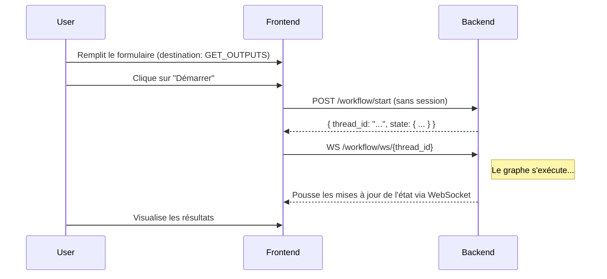
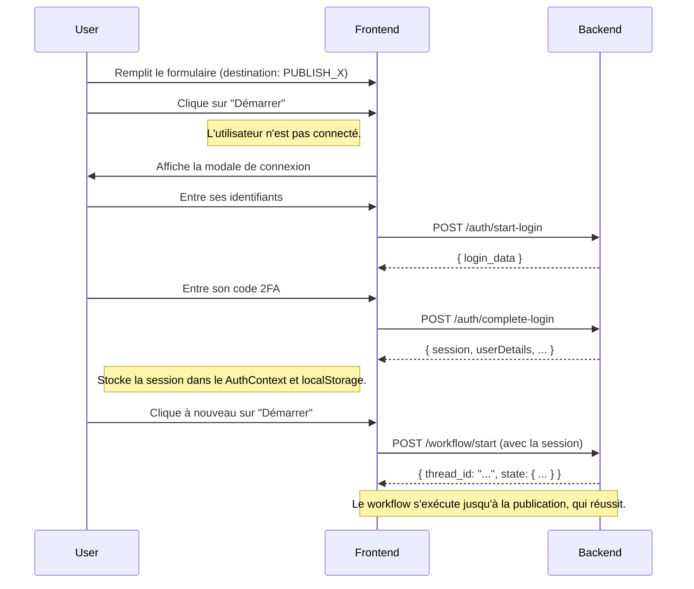

Absolument. C'est une excellente initiative qui va grandement améliorer la logique et l'expérience utilisateur de l'application. Je vais prendre le temps de concevoir un plan détaillé, robuste et clair pour cette restructuration.

Voici le plan complet, qui sera placé dans `x_automation_app/refinement_plan_app.md`.

---


Voici le plan complet, qui sera placé dans `x_automation_app/refinement_plan_app.md`.

---
# Plan de Raffinement : Authentification et Démarrage de Workflow

Ce document détaille la restructuration de la logique d'authentification et de gestion de session pour découpler la connexion de l'utilisateur du cycle de vie d'un workflow.

## **1. Objectif Principal**

L'objectif est de transformer l'authentification d'une étape **obligatoire et initiale** à une action **optionnelle et contextuelle**. L'utilisateur ne devrait avoir à se connecter que lorsque c'est strictement nécessaire (c'est-à-dire pour publier sur X), et sa session de connexion devrait persister entre différentes sessions de navigation et pouvoir être réutilisée pour plusieurs workflows.

## **2. Architecture Cible**

*   **La Session appartient à l'Utilisateur :** Une seule connexion réussie fournit une session qui peut être utilisée par de multiples workflows.
*   **Le Workflow est indépendant :** Un workflow peut être lancé sans aucune session, tant qu'il n'implique pas d'actions nécessitant une authentification (comme la publication).
*   **Le Frontend est la source de vérité pour la session :** Le frontend maintient l'état de connexion de l'utilisateur (via un Contexte React et le `localStorage`) et le fournit au backend lorsque nécessaire.
*   **Le Backend valide et demande :** Le backend est simplifié. Il ne gère plus l'état de connexion entre les appels. Il fait confiance à la session fournie par le frontend et, si une action protégée est demandée sans session valide, il se met en pause et le signale.

---

## **3. Plan d'Action : Modifications du Backend**

### **3.1. Restructuration des Endpoints d'Authentification**

L'authentification ne gère plus de `thread_id`. Son unique but est de retourner une session valide.

*   **`POST /auth/start-login`**
    *   **Payload (inchangé) :** `{ "email", "password", "proxy" }`
    *   **Logique :** Ne crée **plus** de `thread_id` ni d'état de graphe. Appelle simplement `x_utils.start_login`.
    *   **Réponse :** Retourne uniquement le `login_data` nécessaire pour la 2FA. Ex: `{ "login_data": { ... } }`.

*   **`POST /auth/complete-login`**
    *   **Payload :** `{ "login_data", "two_fa_code", "proxy" }` (ne prend plus de `thread_id`).
    *   **Logique :** Appelle `x_utils.complete_login`.
    *   **Réponse :** Retourne l'objet de session complet. Ex: `{ "session": "...", "userDetails": { ... }, "proxy": "..." }`.

### **3.2. Restructuration de l'Endpoint de Démarrage du Workflow**

C'est maintenant le VRAI point d'entrée pour toute interaction avec le graphe.

*   **`POST /workflow/start`**
    *   **Payload :**
        ```json
        {
          "is_autonomous_mode": false,
          "output_destination": "GET_OUTPUTS",
          // ... autres champs de configuration ...
          "session": "la-session-utilisateur-si-elle-existe" // Nouveau champ, optionnel
        }
        ```
    *   **Logique :**
        1.  **Crée un nouveau `thread_id`** à chaque appel avec `uuid.uuid4()`.
        2.  Supprime la vérification `if not current_state.values.get("session")`.
        3.  Initialise l'état du graphe (`OverallState`) avec la configuration reçue. Le champ `session` sera `None` si le frontend ne l'a pas fourni.
        4.  Invoque le graphe (`graph.ainvoke`).
        5.  Retourne le `thread_id` en plus de l'état final pour que le frontend puisse se connecter au WebSocket. Ex: `{ "thread_id": "...", "state": { ... } }`.

*   **`POST /workflow/validate`**
    *   **Logique (inchangée) :** Continue de fonctionner avec le `thread_id` pour mettre à jour un workflow en cours.
    *   **Ajout :** Si une action de validation nécessite une session (ex: une étape d'édition qui publie directement), le frontend devra s'assurer d'avoir la session et de la passer dans une future version. Pour l'instant, on se concentre sur la publication finale.

### **3.3. Mise à jour du Graphe (`agents/graph.py`)**

Nous introduisons une interruption "lazy" pour l'authentification.

1.  **Créer un nouveau nœud d'interruption :**
    ```python
    def await_authentication(state: OverallState) -> dict:
        """Node to pause the workflow and await user authentication."""
        state['next_human_input_step'] = "await_authentication"
        return {"next_human_input_step": "await_authentication"}
    ```

2.  **Ajouter ce nœud au graphe :**
    ```python
    workflow.add_node("await_authentication", await_authentication)
    workflow.interrupt.append("await_authentication")
    ```

3.  **Créer une fonction de routage avant la publication :**
    ```python
    def route_before_publication(state: OverallState) -> str:
        """Checks for a session before allowing publication."""
        if state.get("output_destination") == "PUBLISH_X":
            if not state.get("session"):
                return "await_authentication" # Pause et demande de se connecter
        return "publicator" # Continue normalement
    ```

4.  **Modifier la fin du graphe :**
    *   Le nœud qui précédait `publicator` (probablement `quality_assurer` ou `image_generator`) ne pointera plus directement vers lui. Il pointera vers notre nouvelle fonction de routage.
    *   Le graphe ressemblera à :
        ```python
        # ... from quality_assurer or image_generator ...
        workflow.add_conditional_edges(
            "source_node_before_publicator", # ex: quality_assurer
            route_before_publication,
            {
                "await_authentication": "await_authentication",
                "publicator": "publicator"
            }
        )
        # L'utilisateur se connectera, mettra à jour l'état, et le graphe reprendra
        # après l'interruption, re-évaluant la condition qui sera maintenant valide.
        ```
    *   Il faudra gérer comment le graphe reprend après l'interruption `await_authentication`. La solution la plus simple est que le frontend, après une connexion réussie, rappelle `/workflow/validate` avec une action factice pour réveiller le graphe, qui contiendra désormais la session.

---

## **4. Plan d'Action : Modifications du Frontend**

### **4.1. Création d'un Contexte d'Authentification**

*   **`contexts/AuthContext.tsx` :**
    *   Créer un contexte React qui expose : `{ session, userDetails, proxy, isAuthenticated, login, logout }`.
    *   À l'initialisation, ce contexte doit lire le `localStorage` pour voir si une session y est sauvegardée.
    *   La fonction `login` prendra les données de `POST /auth/complete-login` et mettra à jour l'état et le `localStorage`.
    *   La fonction `logout` videra l'état et le `localStorage`.

### **4.2. Refonte du Flux de l'Application**

1.  **Point d'Entrée (`app/page.tsx`) :** Devient le formulaire de configuration du workflow.
2.  **Layout (`app/layout.tsx`) :** Le header affiche "Se connecter" ou "Bonjour, {userName}" en fonction de l'état `isAuthenticated` du `AuthContext`. Le bouton "Se connecter" ouvre la modale de login.
3.  **Logique de Démarrage de Workflow :**
    *   Sur la page de configuration, l'utilisateur remplit son formulaire.
    *   Quand il clique sur "Démarrer" :
        *   **Cas 1 (`output_destination` != `PUBLISH_X`) :** Appelle directement `POST /workflow/start` sans champ `session`.
        *   **Cas 2 (`output_destination` == `PUBLISH_X`) :**
            *   Vérifie `isAuthenticated` depuis le `AuthContext`.
            *   Si `true`, appelle `POST /workflow/start` en ajoutant la `session` du contexte au payload.
            *   Si `false`, ouvre une `LoginModal`.

### **4.3. Modale de Connexion (`components/shared/LoginModal.tsx`)**

*   Contient les formulaires pour les étapes `start-login` et `complete-login`.
*   En cas de succès, elle appelle la fonction `login()` du `AuthContext` pour mettre à jour l'état global.
*   Une fois la connexion réussie, la modale se ferme. Le processus de démarrage du workflow peut être relancé (automatiquement ou par un nouveau clic de l'utilisateur).

### **4.4. Gestion des Erreurs de Session**

*   **`lib/api.ts` :**
    *   Tous les appels API qui utilisent une session (pour l'instant, seulement `start_workflow` si on publie) doivent avoir une gestion d'erreur.
    *   Dans le `catch` d'une requête, si le code d'erreur est 401 ou 403 (session invalide/expirée) :
        1.  Appeler la fonction `logout()` du `AuthContext` pour nettoyer l'état local.
        2.  Afficher une notification `toast` : "Votre session a expiré. Veuillez vous reconnecter."
        3.  (Optionnel) Ouvrir automatiquement la `LoginModal`.

## **5. Diagramme de Séquence (Nouveau Flux)**

### **Scénario 1 : Génération de contenu simple (`GET_OUTPUTS`)**



### **Scénario 2 : Publication sur X (Besoin de connexion)**

